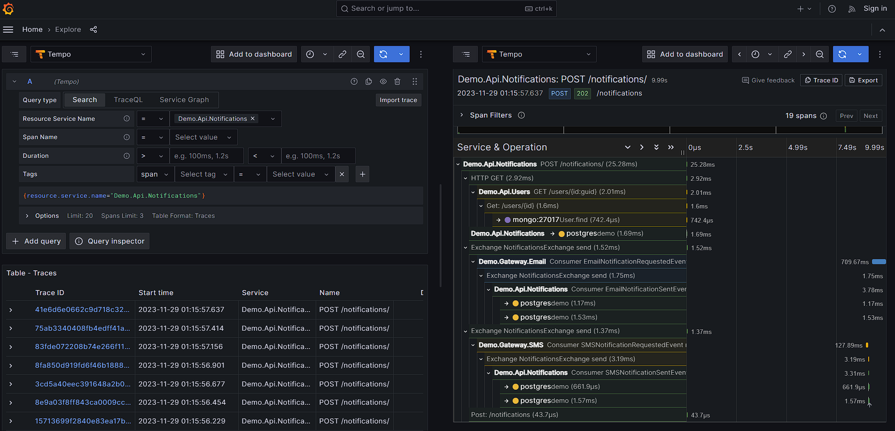

# Demo - Distributed Tracing with OpenTelemetry

## Components

### OpenTelemetry

#### Pattern

Context Propagation

#### Documentation

- [OpenTelemetry](https://opentelemetry.io/docs/)
- [OpenTelemetry .NET](https://opentelemetry.io/docs/instrumentation/net/)
- [OpenTelemetry .NET](https://opentelemetry.io/docs/instrumentation/net/getting-started/)
- [OpenTelemetry .NET Exporters](https://opentelemetry.io/docs/instrumentation/net/exporters/)

### RabbitMQ

- [Semantic Conventions for Messaging Systems](https://github.com/open-telemetry/semantic-conventions/tree/main/docs/messaging)
- [.NET Implementation](https://github.com/open-telemetry/opentelemetry-dotnet/tree/main/examples/MicroserviceExample)
